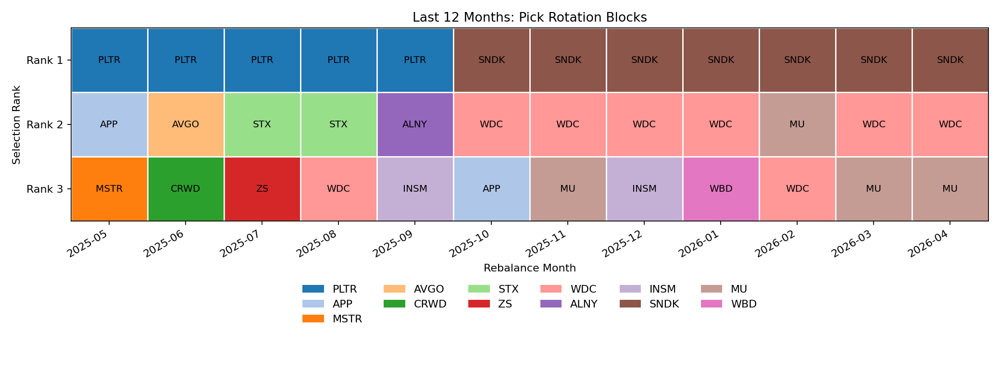

# Nasdaq-100 Monthly Momentum Backtest

This project implements a monthly momentum rotation strategy for a survivorship-biased Nasdaq-100 universe. On each first trading day of the month, the strategy ranks eligible tickers by their prior six completed monthly returns, selects the top three names, holds them for one month, and compares the result with `QQQ` and `TQQQ`.

## Project Layout

- `data/raw_prices/`: cached adjusted OHLCV CSV files downloaded with `yfinance`
- `data/nasdaq100_membership.csv`: membership template used by the backtest
- `outputs/`: generated CSV reports and charts
- `src/`: modular backtest code
- `tests/`: unit tests for signal and accounting behavior
- `logs/`: runtime logs

## Bias Controls

- `current_constituents` mode is survivorship-biased by design.
- A clean historical simulation requires historical Nasdaq-100 membership dates.
- Momentum signals use only the six completed months before each rebalance date.
- The current partial month is never included in ranking.
- The implementation excludes tickers with insufficient return history or missing holding-period prices.
- Price downloads use adjusted prices from `yfinance`, so splits and dividends are reflected in the close series.
- Execution is approximated at adjusted close on the first trading day of each month.

## Setup

```bash
python3 -m venv .venv
source .venv/bin/activate
.venv/bin/python -m pip install -r requirements.txt
```

## Run

```bash
.venv/bin/python main.py \
  --start-date 2016-01-01 \
  --end-date 2026-05-12 \
  --top-n 3 \
  --lookback-months 6 \
  --benchmark QQQ \
  --secondary-benchmark TQQQ
```

Optional score methods:

- `average_monthly_return`
- `compound_6m_return`

## Outputs

- `outputs/monthly_selections.csv`
- `outputs/portfolio_returns.csv`
- `outputs/summary_stats.csv`
- `outputs/comparison_stats.csv`
- `outputs/last_12_month_picks.csv`
- `outputs/charts/*.png`

The reporting layer also creates:

- `outputs/charts/last_12_month_pick_rotation.png`
- `outputs/charts/last_12_month_selection_frequency.png`

Reference defaults:

- Transaction cost: `0` bps
- Slippage: `0` bps
- Minimum valid return history: `6` completed months

## Last 12 Months Pick Rotation



## Membership Notes

The included membership CSV is a starter template in `current_constituents` mode. Replace or expand it with a validated full Nasdaq-100 constituent file for production research, or add historical `start_date` and `end_date` values to reduce survivorship bias.
